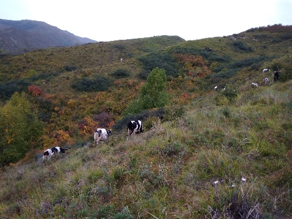

# 有损图像压缩算法

Run

```sh
mkdir build
cd build&&cmake ../&&cmake --build .&&cd ..&&./build/OpenCV_learn
```

## 新增->破坏盲水印

一般的盲水印就是加个高透明度图片(文字), 这个可以通过调整图片的gamma，RGB颜色值看到。

```c++
uncompressImage(); // 普通水印
```

```c++
// <https://github.com/guofei9987/blind_watermark> 
uncompressImageWaterMaker()//图片色彩艳丽，破坏就很严重
```

可能每个图片都需要调整参数。

/assets/a,png 就是带有水印的图片。解码代码：

```py
from blind_watermark import WaterMark
bwm1 = WaterMark(password_img=1, password_wm=1)
wm_extract = bwm1.extract('output/embedded.png', wm_shape=191, mode='str')
print(wm_extract)
```

## 算法

删除每一个像素(24位)每个RGB值的最后一位(降低对比度).

存储jpg文件更小, 因为jpg算法也做了一次处理, 也导致部分颜色完全不正常.

## 结果

测试图片(assets/b.jpg)

|压缩前|压缩后|
|---|---|
|179.1kb|29.4kb(jpg)|
|179.1kb|120.3kb(webp,no loss)|
|179.1kb|32.3kb(webp,100)|


B 原图, C 压缩后, C2 直接内存数据复原, uncompress 存储成 jpg 文件后再复原.

## 缺陷

1. 色域会有损失


