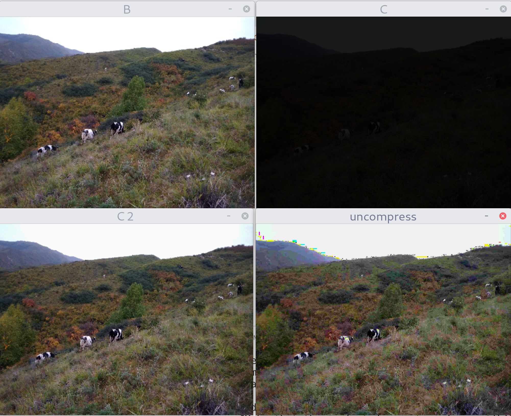

# 有损图像压缩算法

Run

```sh
make build
cd build&&cmake ../&&cmake --build .&&cd ..&&./build/OpenCV_learn
```

## 算法

删除每一个像素(24位)每个RGB值的最后一位(降低对比度).

存储jpg文件更小, 因为jpg算法也做了一次处理, 也导致部分颜色完全不正常.

opencv 直接存储webp会变大

## 结果

|压缩前|压缩后|
|---|---|
|179.1kb|29.4kb(jpg)|
|179.1kb|120.3kb(webp,no loss)|
|179.1kb|32.3kb(webp,100)|



B 原图, C 压缩后, C2 直接内存数据复原, uncompress 存储成 jpg 文件后再复原.

## 缺陷

1. 色域会有损失
